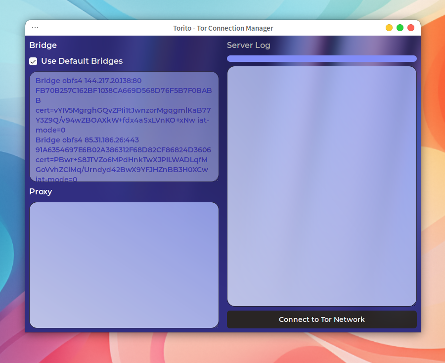
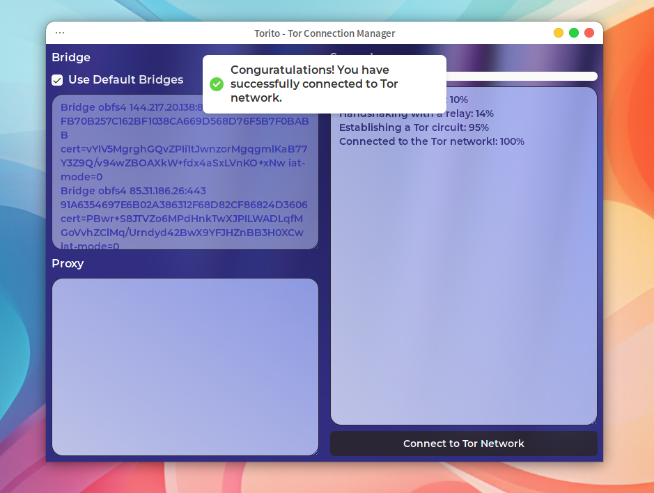

<div align="center">
  
  <h1>Torito</h1>
  <p>Tor Connection Manager</p>
</div>

<div align="center">


</div>

## Description

Torito is a simple Tor connection manager.  
This tool allows you to connect to the Tor network and set up tor bridges or proxies.

Inspired by [Anon Connection Wizard](https://www.whonix.org/wiki/Anon_Connection_Wizard).

## Features

- Edit Bridges Configuration
- Edit Proxy Configuration
- Connect to Tor Network

## Installation

Download the latest release from the [releases page](https://github.com/calloc134/torito-frontend/releases).  
Add `torito.toml` to `/etc/tor/` directory.
Here is an example of `torito.toml`:

```toml
torrcPath = "/etc/tor/torrc" # Path to torrc file
backUpDirName = "/home/user/torrcBackUp" # Don't forget to make this directory
torIp = "localhost" # Tor Control IP
torPort = 9051 # Tor ControlPort
```

Run:

```bash
chmod +x ./tauri-test_x.x.x_amd64.AppImage
sudo ./tauri-test_x.x.x_amd64.AppImage
```

## Development

### Prerequisites

- [Tauri](https://tauri.app/)
- [React](https://react.dev)
- [Vite](https://vitejs.dev/)
- [Tailwind CSS](https://tailwindcss.com/)
- [shadcn UI](https://ui.shadcn.com/)
- [Aceternity UI](https://ui.aceternity.com/)
- [react-hot-toast](https://react-hot-toast.com/)

Backend Server is written in FastAPI and built with PyInstaller.  
Here is the [link](https://github.com/calloc134/torito-backend).
